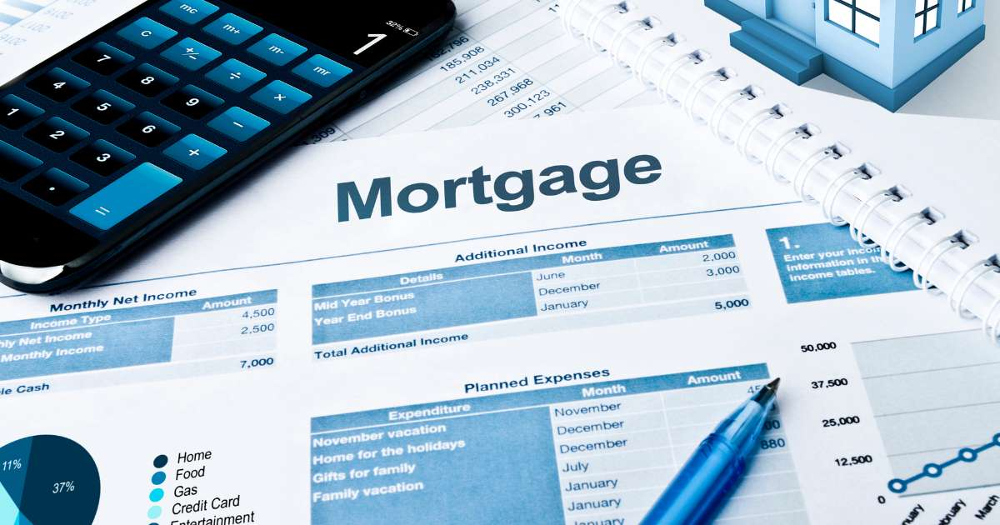

# Bank Loan Power BI Report

## Introduction
The **Bank Loan Report Dashboard** provides an interactive summary of key metrics related to loan applications, funding, and repayments. It is designed to offer a clear view of loan performance, distinguishing between good and bad loans, and includes a comprehensive analysis of loan statuses. This dashboard supports stakeholders in understanding the overall financial health and trends of loan portfolios.

## Key Features
- **Total Loan Applications**:
  - Displays the total number of loan applications processed, including month-to-date (MTD) and month-over-month (MoM) growth.
- **Total Funded Amount**:
  - Shows the total value of loans funded, including MTD and MoM growth.
- **Total Amount Received**:
  - Reflects the total amount received from loan repayments, with MTD and MoM comparisons.
- **Good Loan Issued Analysis**:
  - Highlights the percentage of total loans considered as "Good Loans" (e.g., fully paid or current).
  - Includes detailed metrics on the number of good loan applications, total funded amounts, and amounts received.
- **Bad Loan Issued Analysis**:
  - Displays the percentage of total loans considered as "Bad Loans" (e.g., charged off).
  - Shows detailed metrics on the number of bad loan applications, total funded amounts, and amounts received.
- **Loan Status Breakdown**:
  - A table detailing loan statuses (e.g., Fully Paid, Charged Off, Current) and their respective total loan applications, funded amounts, received amounts, MTD funded amounts, and PMTD (previous month-to-date) total received amounts.

## Visual Highlights
### Key Metrics Panels
- Highlighted panels provide quick insights into total applications, total funded amounts, and total received amounts.

### Doughnut Charts
- Visual representation of the proportion of good and bad loans for an easy assessment of the loan portfolio's quality.

### Data Table
- A detailed table that lists loan statuses and their associated financial metrics for more in-depth analysis.

## Usage
This dashboard is intended for use by financial analysts, loan officers, and decision-makers in the banking and financial industry. It helps identify trends in loan performance, supports risk assessment, and facilitates strategic planning.

## Data Sources
The dashboard is based on a dataset that includes fields such as `loan_status`, `funded_amount`, `amount_received`, and time-based metrics like MTD and PMTD.

## Future Enhancements
- Adding trend analysis over multiple months.
- Including more granular filtering options (e.g., by loan type or borrower demographics).
- Integrating predictive analytics for forecasting future loan performance.
